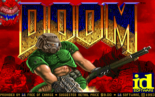

# RV32IM — single-cycle → pipelined → DOOM

A RISC-V (RV32IM) CPU written from scratch in SystemVerilog, taken one
architectural step at a time until it was fast enough — and had enough of
a memory system around it — to run **DOOM** on a Zybo Z7-20.

```
single-cycle  ──►  5-stage pipelined  ──►  FPGA bring-up  ──►  raycaster  ──►  DDR + caches  ──►  DOOM
     ✓                   ✓                    ✓                  ✓                ✓               ✓
```



*DOOM's title screen rendered by the from-scratch core — captured straight out
of a cycle-accurate Verilator simulation of the synthesizable RTL (the same RTL
that goes to the FPGA).*

---

## The short version

- **CPU.** Single-cycle first, then a classic in-order 5-stage pipeline with full
  forwarding, hazard detection, and a multi-cycle divider. Both versions verified
  bit-exact against [Spike](https://github.com/riscv-software-src/riscv-isa-sim).
- **Bring-up.** LED/MMIO blinker, then UART, then a textured raycaster over HDMI —
  enough of an SoC to prove the datapath, I/O, and video pipeline on real hardware.
- **Memory system.** Direct-mapped write-back caches (one for instructions, one for
  data) backed by an AXI4 burst master into the Zynq PS DDR. This is what made a
  multi-megabyte program like DOOM possible.
- **DOOM.** A [doomgeneric](https://github.com/ozkl/doomgeneric) port running
  bare-metal on the core: newlib + a tiny syscall layer, the WAD served straight
  out of DDR, and the 320×200 8-bit framebuffer pushed out over HDMI.

---

## How DOOM runs on it

DOOM's renderer is, conveniently, already 320×200 with an 8-bit indexed palette —
exactly the shape of the hardware framebuffer. So the platform layer is mostly a
memory copy:

```
DDR ── I-cache ──► fetch          (.text at 0x10000000)
DDR ── D-cache ──► load/store      (heap, stack, DOOM zone, WAD)
CPU ── MMIO    ──► framebuffer (0xA) + palette (0xB) ── video_fb ── rgb2dvi ── HDMI
```

- **Memory map.** Program at `0x10000000`, ~32 MB zone heap above it, stack at
  `0x14000000`, and the shareware WAD at `0x18000000`. All of it lives in the PS
  DDR; the CPU reaches DDR purely through its own caches and AXI burst master —
  the ARM only brings up the clocks and the DDR controller.
- **Bare-metal C.** newlib for the standard library, a small `crt0` + linker script,
  and a syscall shim (`_open`/`_read`/`_sbrk`/…) that serves the WAD from DDR and
  routes `printf` to a UART mailbox.
- **Input.** The four slide switches map to turn / walk / fire.

It runs both on the board and, frame-for-frame identically, in a Verilator
simulation of the exact synthesizable core — which is how the screenshot above was
produced and how the whole thing was debugged.

---

## A bug worth mentioning

DOOM booted, ran its entire init, and then corrupted a single value deep inside
the WAD loader — but only sometimes, and moving a line of code made it move
somewhere else. Classic Heisenbug.

It turned out to be a **forwarding bug across a multi-cycle stall**. On a cache
miss the pipeline freezes while DDR is fetched. The MEM/WB register was being
*bubbled* during that freeze, which dropped a just-retired producer out of the WB
stage after one cycle. A consumer frozen in EX across the same stall then lost its
write-back forwarding path and fell back to a stale operand it had latched in ID.
The trigger was a `load → use` with an intervening store that happened to miss the
cache, so it only fired on specific address/layout combinations — invisible to the
simple test programs, fatal to DOOM's compiled code.

The fix is one `if`: **hold** MEM/WB during a stall instead of bubbling it, so the
producer stays in WB and forwarding stays valid. A cycle-accurate Verilator
harness with a golden-memory checker (mirror every store, verify every load)
pinned it down to the exact instruction.

---

## Architecture

### Pipeline (`rtl/top/rv32im_core_pipelined.sv`)

Classic in-order `IF → ID → EX → MEM → WB`.

- Predict-not-taken branches, resolved in EX.
- Forwarding from MEM and WB into EX (forwarding the *actual* MEM-stage result —
  load data, not the address; `pc+4` for jumps).
- Load-use: one-cycle stall. DIV/REM: multi-cycle, holds ID/EX. MUL is combinational.
- `imem_ready`/`dmem_ready` back-pressure so the same core works behind a
  single-cycle BRAM *or* a multi-cycle cache+DDR backend.

### Memory (`rtl/memory/cache.sv`, `rtl/peripherals/axi_burst_master.sv`)

Direct-mapped, write-back, write-allocate cache (8 KB default). The same module is
instantiated read-only as an I-cache and read/write as a D-cache. A cache line maps
to an AXI4 INCR burst; two masters fan into a SmartConnect → PS `S_AXI_HP` → DDR.

### Video (`rtl/video/`)

A dual-clock 320×200 8-bit framebuffer with a 256-entry palette, scanned out at
25 MHz and serialized to HDMI through Digilent's `rgb2dvi`.

### SoC (`rtl/top/rv32im_doom_core.sv`)

Ties the core, both caches/bursts, and an MMIO bridge (LEDs, cycle counter,
switches, framebuffer, palette) together. Address bit decode picks DDR vs MMIO.

---

## Repo layout

```
rtl/
├── core/        decoder, regfile, ALU, branch unit, mul/div, hazard +
│                forwarding units, package
├── memory/      cache, MMIO bridge, BRAM imem/dmem, behavioural AXI DDR (sim)
├── peripherals/ AXI burst master, AXI-lite master
├── video/       framebuffer, palette, timing, HDMI top
└── top/         single-cycle, pipelined, and the DDR/DOOM SoC cores

tb/integration/  Verilator testbenches (core, cache, DDR, full DOOM sim)
software/        bare-metal programs: test vectors, LED/UART demos, raycaster,
                 and the DOOM libc layer (crt0, syscalls, malloc, printf, linker)
doom/            doomgeneric port + the RV32IM platform layer
scripts/         Makefile, Vivado/Vitis TCL, Spike co-sim
docs/            the full write-up (docs/design.md) + datapath diagrams
```

---

## Build & run

### Verify the CPU against Spike

```bash
cd scripts
make verify       # single-cycle: 32/32 regs match
make verify-pipe  # pipelined:    32/32 regs match
```

### Run DOOM in simulation (no board needed)

This drives the real synthesizable SoC in Verilator against a behavioural DDR
model preloaded with the program and the WAD, and dumps a framebuffer snapshot to
`sim/doom_frame.png`.

```bash
bash scripts/build_doom.sh           # build software/doom.bin
# regenerate sim/sim_doom_{i,d}.hex from doom.bin + doom1.wad, then:
verilator --binary --top-module tb_doom_sim ... tb/integration/tb_doom_sim.sv
./sim/obj_dir_doomsim/Vtb_doom_sim
```

(See `docs/design.md` for the exact commands.)

### Run DOOM on the Zybo Z7-20

```bash
cd vivado_doom && vivado -mode batch -source ../scripts/build_doom_soc.tcl   # bitstream
xsct scripts/run_doom.tcl                                                    # load + boot
```

`run_doom.tcl` brings up the PS clocks/DDR, loads `doom.bin` and the WAD into DDR
over JTAG, and configures the PL. HDMI out, switches for input.

---

## Status & notes

- Single-cycle and pipelined cores: done, Spike-verified.
- DOOM: boots and renders on the Zybo and in simulation.
- The CPU is board-portable; only the memory backend (DDR vs on-chip BRAM) and the
  I/O pins are platform-specific. Small programs (the raycaster) fit in BRAM on a
  plain FPGA; DOOM needs the external-memory path.
- Shareware `DOOM1.WAD` only. Audio is stubbed.
